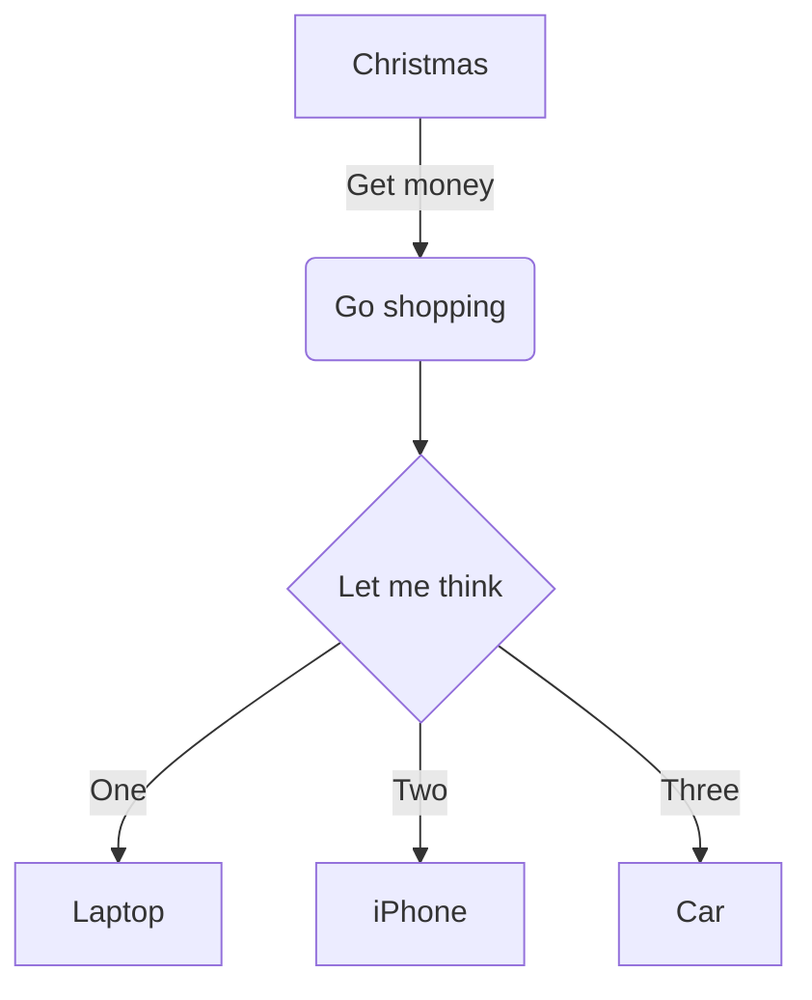
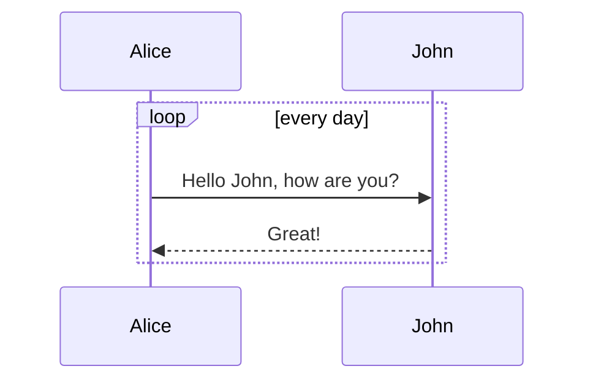
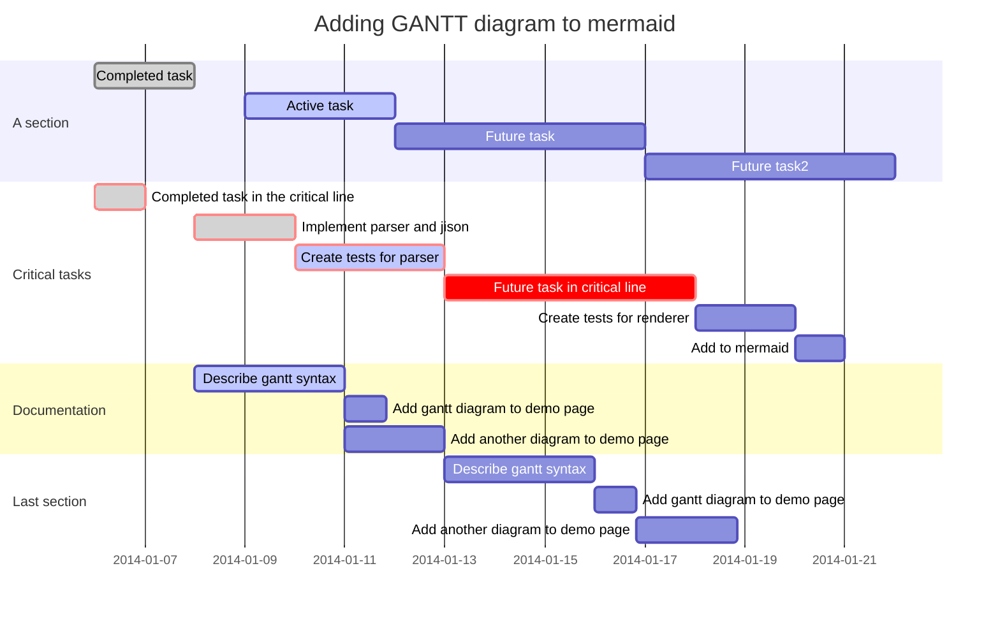

# Code Renderer

Codex implements various code-based render languages which can be defined using Markdown fenced code.   


<!--*codex:tabs*-->
<!--*codex:tab('Hyperscript')*-->

Documentation can be found at [Frontend > Components](../frontend/components#codex:document['frontend/components'])  

<!--*codex:row({ gutter: 10 })*-->
<!--*codex:col({ md: 16 })*-->
**Code**
```markdown
    ```hyper
    h('div', { style: { border: '1px solid lightgrey', padding: '0 20px' } }, h([
        h('p', 'Wrapped in fragment'),
        h('p', 'Requires no keys'),
        h('div', [
            h('p', { key: 1 }, 'Not wrapped in fragment'),
            h('p', { key: 2 }, 'Requires keys to be provided'),
            h('div', { key: 3, className: 'foobar' }, 'The content of div.foobar'),
        ]),            
        h('c-tabs', { style: { border: '1px solid lightgrey', margin: '15px 0' } }, [
            h('c-tab', { key: 'foo', tab: 'foo' }, h('p','The foo tab')),
            h('c-tab', { key: 'bar', tab: 'bar' }, h('p','The bar tab')),
            h('c-tab', { key: 'ape', tab: 'ape' }, h([
               h('p', 'content string'),
               h('p', 'content string'),
               h('p', 'content string'),
               h('p', 'content string'),
           ])),
        ]),
    ]));
    ```
```
<!--*codex:/col*-->
<!--*codex:col({ md: 8 })*-->
**Output** 
```hyper
h('div', { style: { border: '1px solid lightgrey', padding: '0 20px' } }, h([
    h('p', 'Wrapped in fragment'),
    h('p', 'Requires no keys'),
    h('div', [
        h('p', { key: 1 }, 'Not wrapped in fragment'),
        h('p', { key: 2 }, 'Requires keys to be provided'),
        h('div', { key: 3, className: 'foobar' }, 'The content of div.foobar'),
    ]),            
    h('c-tabs', { style: { border: '1px solid lightgrey', margin: '15px 0' } }, [
        h('c-tab', { key: 'foo', tab: 'foo' }, h('p','The foo tab')),
        h('c-tab', { key: 'bar', tab: 'bar' }, h('p','The bar tab')),
        h('c-tab', { key: 'ape', tab: 'ape' }, h([
           h('p', 'content string'),
           h('p', 'content string'),
           h('p', 'content string'),
           h('p', 'content string'),
       ])),
    ]),
]));
```
<!--*codex:/col*-->
<!--*codex:/row*-->


<!--*codex:/tab*-->
<!--*codex:tab('UML')*-->

Uses [nomnoml](https://github.com/skanaar/nomnoml)

**Example 1**

```nomnoml
[<frame>Decorator pattern|
  [<abstract>Component||+ operation()]
  [Client] depends --> [Component]
  [Decorator|- next: Component]
  [Decorator] decorates -- [ConcreteComponent]
  [Component] <:- [Decorator]
  [Component] <:- [ConcreteComponent]
]
```

```markdown
    ```nomnoml
    [<frame>Decorator pattern|
      [<abstract>Component||+ operation()]
      [Client] depends --> [Component]
      [Decorator|- next: Component]
      [Decorator] decorates -- [ConcreteComponent]
      [Component] <:- [Decorator]
      [Component] <:- [ConcreteComponent]
    ]
    ```
```

**Example 2**
```nomnoml
#direction: right
#.box: fill=pink italic bold visual=rhomb

[<frame>frame|[some class]]
[<package>package|[some class]]
[<box>box]
[class|items: Object\[\]] - [<hidden> hidden]
[hidden] - [<label> label]
[hidden] - [instance]
[<abstract> abstract] - [<instance> instance]
[<note> note] -- [<reference> reference]
[<package> package] <- [<frame> frame]
[<database> database] <:- [<start> start]
[<end> end] -/- [<state> state]
[<choice> choice] <-o [<input> input]
[<sender> sender] <-+ [<receiver> receiver]
[<actor> actor] <-> [<usecase> usecase]
```

```markdown
    ```nomnoml
    #direction: right
    #.box: fill=pink italic bold visual=rhomb
    
    [<frame>frame|[some class]]
    [<package>package|[some class]]
    [<box>box]
    [class|items: Object\[\]] - [<hidden> hidden]
    [hidden] - [<label> label]
    [hidden] - [instance]
    [<abstract> abstract] - [<instance> instance]
    [<note> note] -- [<reference> reference]
    [<package> package] <- [<frame> frame]
    [<database> database] <:- [<start> start]
    [<end> end] -/- [<state> state]
    [<choice> choice] <-o [<input> input]
    [<sender> sender] <-+ [<receiver> receiver]
    [<actor> actor] <-> [<usecase> usecase]
    ```
```

<!--*codex:/tab*-->
<!--*codex:tab('Charts')*-->


<!--*codex:tabs*-->
<!--*codex:tab('Line Chart')*-->

Uses [chartjs](http://www.chartjs.org/docs/)    
    
[Documentation for Line Chart](http://www.chartjs.org/docs/#line-chart)


```chart
{
  "type": "line",
  "data": {
    "labels": [
      "January",
      "February",
      "March",
      "April",
      "May",
      "June",
      "July"
    ],
    "datasets": [
      {
        "label": "# of bugs",
        "fill": false,
        "lineTension": 0.1,
        "backgroundColor": "rgba(75,192,192,0.4)",
        "borderColor": "rgba(75,192,192,1)",
        "borderCapStyle": "butt",
        "borderDash": [],
        "borderDashOffset": 0,
        "borderJoinStyle": "miter",
        "pointBorderColor": "rgba(75,192,192,1)",
        "pointBackgroundColor": "#fff",
        "pointBorderWidth": 1,
        "pointHoverRadius": 5,
        "pointHoverBackgroundColor": "rgba(75,192,192,1)",
        "pointHoverBorderColor": "rgba(220,220,220,1)",
        "pointHoverBorderWidth": 2,
        "pointRadius": 1,
        "pointHitRadius": 10,
        "data": [
          65,
          59,
          80,
          81,
          56,
          55,
          40
        ],
        "spanGaps": false
      }
    ]
  },
  "options": {}
}
```


```markdown

    ```chart
    {
      "type": "line",
      "data": {
        "labels": [
          "January",
          "February",
          "March",
          "April",
          "May",
          "June",
          "July"
        ],
        "datasets": [
          {
            "label": "# of bugs",
            "fill": false,
            "lineTension": 0.1,
            "backgroundColor": "rgba(75,192,192,0.4)",
            "borderColor": "rgba(75,192,192,1)",
            "borderCapStyle": "butt",
            "borderDash": [],
            "borderDashOffset": 0,
            "borderJoinStyle": "miter",
            "pointBorderColor": "rgba(75,192,192,1)",
            "pointBackgroundColor": "#fff",
            "pointBorderWidth": 1,
            "pointHoverRadius": 5,
            "pointHoverBackgroundColor": "rgba(75,192,192,1)",
            "pointHoverBorderColor": "rgba(220,220,220,1)",
            "pointHoverBorderWidth": 2,
            "pointRadius": 1,
            "pointHitRadius": 10,
            "data": [
              65,
              59,
              80,
              81,
              56,
              55,
              40
            ],
            "spanGaps": false
          }
        ]
      },
      "options": {}
    }
    ```

```


<!--*codex:/tab*-->
<!--*codex:tab('Bar Chart')*-->

[Documentation for Bar Chart](http://www.chartjs.org/docs/#bar-chart)


```chart
{
  "type": "bar",
  "data": {
  "labels": [
    "Red",
    "Blue",
    "Yellow",
    "Green",
    "Purple",
    "Orange"
  ],
  "datasets": [
    {
    "label": "# of Votes",
    "data": [
      12,
      19,
      3,
      5,
      2,
      3
    ],
    "backgroundColor": [
      "rgba(255, 99, 132, 0.2)",
      "rgba(54, 162, 235, 0.2)",
      "rgba(255, 206, 86, 0.2)",
      "rgba(75, 192, 192, 0.2)",
      "rgba(153, 102, 255, 0.2)",
      "rgba(255, 159, 64, 0.2)"
    ],
    "borderColor": [
      "rgba(255,99,132,1)",
      "rgba(54, 162, 235, 1)",
      "rgba(255, 206, 86, 1)",
      "rgba(75, 192, 192, 1)",
      "rgba(153, 102, 255, 1)",
      "rgba(255, 159, 64, 1)"
    ],
    "borderWidth": 1
    }
  ]
  },
  "options": {}
}
```

<!--*codex:/tab*-->
<!--*codex:tab('Radar Chart')*-->

[Documentation for Radar Chart](http://www.chartjs.org/docs/#radar-chart)

```chart
{
  "type": "radar",
  "data": {
    "labels": [
      "Eating",
      "Drinking",
      "Sleeping",
      "Designing",
      "Coding",
      "Cycling",
      "Running"
    ],
    "datasets": [
      {
        "label": "My First dataset",
        "backgroundColor": "rgba(179,181,198,0.2)",
        "borderColor": "rgba(179,181,198,1)",
        "pointBackgroundColor": "rgba(179,181,198,1)",
        "pointBorderColor": "#fff",
        "pointHoverBackgroundColor": "#fff",
        "pointHoverBorderColor": "rgba(179,181,198,1)",
        "data": [
          65,
          59,
          90,
          81,
          56,
          55,
          40
        ]
      },
      {
        "label": "My Second dataset",
        "backgroundColor": "rgba(255,99,132,0.2)",
        "borderColor": "rgba(255,99,132,1)",
        "pointBackgroundColor": "rgba(255,99,132,1)",
        "pointBorderColor": "#fff",
        "pointHoverBackgroundColor": "#fff",
        "pointHoverBorderColor": "rgba(255,99,132,1)",
        "data": [
          28,
          48,
          40,
          19,
          96,
          27,
          100
        ]
      }
    ]
  },
  "options": {}
}
```

<!--*codex:/tab*-->
<!--*codex:tab('Polar Area Chart')*-->


[Documentation for Polar Area Chart](http://www.chartjs.org/docs/#polar-area-chart)


```chart
{
  "type": "polarArea",
  "data": {
    "datasets": [
      {
        "data": [
          11,
          16,
          7,
          3,
          14
        ],
        "backgroundColor": [
          "#FF6384",
          "#4BC0C0",
          "#FFCE56",
          "#E7E9ED",
          "#36A2EB"
        ],
        "label": "My dataset"
      }
    ],
    "labels": [
      "Red",
      "Green",
      "Yellow",
      "Grey",
      "Blue"
    ]
  },
  "options": {}
}
```

<!--*codex:/tab*-->
<!--*codex:tab('Pie Chart')*-->


[Documentation for Pie Chart](http://www.chartjs.org/docs/#doughnut-pie-chart)

```chart
{
  "type": "pie",
  "data": {
    "labels": [
      "Red",
      "Blue",
      "Yellow"
    ],
    "datasets": [
      {
        "data": [
          300,
          50,
          100
        ],
        "backgroundColor": [
          "#FF6384",
          "#36A2EB",
          "#FFCE56"
        ],
        "hoverBackgroundColor": [
          "#FF6384",
          "#36A2EB",
          "#FFCE56"
        ]
      }
    ]
  },
  "options": {}
}
```

<!--*codex:/tab*-->
<!--*codex:tab('Doughnut Chart')*-->


[Documentation for Doughnut Chart](http://www.chartjs.org/docs/#doughnut-pie-chart)


```chart
{
  "type": "doughnut",
  "data": {
    "labels": [
      "Red",
      "Blue",
      "Yellow"
    ],
    "datasets": [
      {
        "data": [
          300,
          50,
          100
        ],
        "backgroundColor": [
          "#FF6384",
          "#36A2EB",
          "#FFCE56"
        ],
        "hoverBackgroundColor": [
          "#FF6384",
          "#36A2EB",
          "#FFCE56"
        ]
      }
    ]
  },
  "options": {}
}
```

<!--*codex:/tab*-->
<!--*codex:tab('Bubble Chart')*-->


```chart
{
  "type": "bubble",
  "data": {
    "datasets": [
      {
        "label": "First Dataset",
        "data": [
          {
            "x": 20,
            "y": 30,
            "r": 15
          },
          {
            "x": 40,
            "y": 10,
            "r": 10
          }
        ],
        "backgroundColor": "#FF6384",
        "hoverBackgroundColor": "#FF6384"
      }
    ]
  },
  "options": {}
}
```

<br/>

[Documentation for Bubble Chart](http://www.chartjs.org/docs/#bubble-chart)
    
    
<!--*codex:/tab*-->
<!--*codex:/tabs*-->
   
    
<!--*codex:/tab*-->
<!--*codex:tab('Diagrams')*-->

<!--*codex:tabs({ tabPosition:'left' })*-->
<!--*codex:tab('Flowchart')*-->

[Flowchart Syntax](http://knsv.github.io/mermaid/#flowcharts-basic-syntax)

```markdown
    ```mermaid
    graph TD
    A[Christmas] -->|Get money| B(Go shopping)
    B --> C{Let me think}
    C -->|One| D[Laptop]
    C -->|Two| E[iPhone]
    C -->|Three| F[Car]
    ```
```


<!--*codex:/tab*-->
<!--*codex:tab('Sequence Diagram')*-->


[Sequence Diagram Syntax](http://knsv.github.io/mermaid/#sequence-diagrams)

```markdown
    ```mermaid
    sequenceDiagram
    loop every day
        Alice->>John: Hello John, how are you?
        John-->>Alice: Great!
    end
    ```
```

<!--*codex:/tab*-->
<!--*codex:tab('Gantt Diagram')*-->


[Gantt Diagram Syntax](http://knsv.github.io/mermaid/#gant-diagrams)



```markdown
    ```mermaid
    gantt
    dateFormat  YYYY-MM-DD
    title Adding GANTT diagram to mermaid
    
    section A section
    Completed task            :done,    des1, 2014-01-06,2014-01-08
    Active task               :active,  des2, 2014-01-09, 3d
    Future task               :         des3, after des2, 5d
    Future task2               :         des4, after des3, 5d
    
    section Critical tasks
    Completed task in the critical line :crit, done, 2014-01-06,24h
    Implement parser and jison          :crit, done, after des1, 2d
    Create tests for parser             :crit, active, 3d
    Future task in critical line        :crit, 5d
    Create tests for renderer           :2d
    Add to mermaid                      :1d
    
    section Documentation
    Describe gantt syntax               :active, a1, after des1, 3d
    Add gantt diagram to demo page      :after a1  , 20h
    Add another diagram to demo page    :doc1, after a1  , 48h
    
    section Last section
    Describe gantt syntax               :after doc1, 3d
    Add gantt diagram to demo page      : 20h
    Add another diagram to demo page    : 48h
    ```
```

<!--*codex:/tab*-->
<!--*codex:tab('Git graph')*-->

**experimental**

```markdown
    ```mermaid
    gitGraph:
    options
    {
        "nodeSpacing": 150,
        "nodeRadius": 10
    }
    end
    commit
    branch newbranch
    checkout newbranch
    commit
    commit
    checkout master
    commit
    commit
    merge newbranch
    ```
```

<!--*codex:/tab*-->
<!--*codex:/tabs*-->

<!--*codex:/tab*-->

<!--*codex:tab('Mathematica')*-->

asf

<!--*codex:/tab*-->
<!--*codex:/tabs*-->
