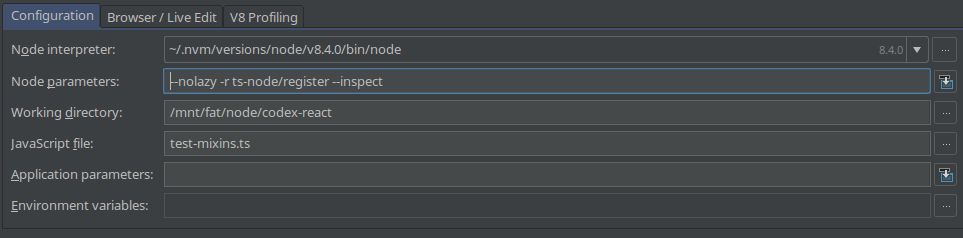

# ts-node debugging

Sure, IntelliJ IDEA/PHPStorm can debug .ts files.
 
But it requires you to have its compiler enabled... There's enough cases that this is not a easy/wanted/neat option as it will completely compile all your .ts to .js.

So without further ado:

> If you did not know, all webpack.config files can be written in TS. Webpack detects it and runs them.   I personally don't have any .js file anymore in my project.

Using the above configuration to your advantage, you can get in-dept debugging for some try-out code, webpack issues, server issues.. you name it.
